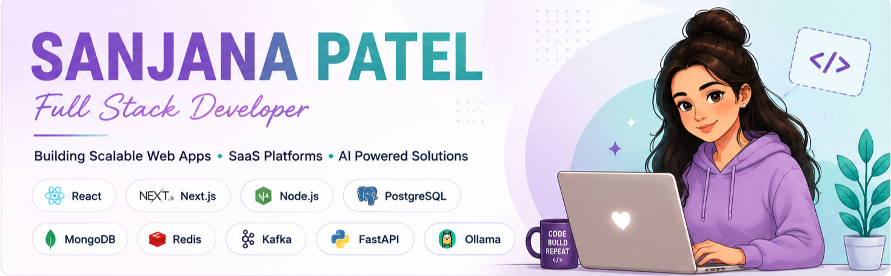

<h1 align="left">Hi, I'm Sanjana 👋🏻</h1>

<p align="center">
  
</p>

<p>
I'm a <strong>Full Stack Developer with 4+ years of experience</strong>
building scalable web applications and SaaS platforms. I enjoy designing
secure, maintainable and production-ready systems using modern frontend,
backend and cloud technologies.
</p>

<h2>👩‍💻 About Me</h2>

<table>
<tr>
<td width="50%">

## 🚀 What I Do

<p>
  
  
  
</p>

<p>
  
  
  
</p>

---

## 🌱 Currently Learning

<p>
  
  
  
  
</p>

<p>
  
  
  
  
</p>

## 🛠️ Tech Stack

### 🎨 Frontend

<p>

</p>

**React.js • Next.js • TypeScript • Tailwind CSS • Redux • Zustand • React Query**

### ⚡ Backend

<p>

</p>

**Node.js • Express.js • Hono • Python • FastAPI • REST APIs • WebSockets • Socket.IO**

### 🗄️ Databases

<p>

</p>

**PostgreSQL • MongoDB • MySQL • SQLite • Redis • Prisma**

### 📨 Messaging & Distributed Systems

<p>

</p>

**Apache Kafka • RabbitMQ • BullMQ • Redis**

### ☁️ DevOps & Cloud

<p>

</p>

**Docker • Kubernetes • CI/CD • GitHub Actions • Linux**

### 🤖 AI

<p>


</p>

**Ollama • Local LLMs • AI Integration • AI-powered Applications**

---

## 🏗️ Architecture & Engineering

```text
System Design
     ↓
Microservices
     ↓
Event Driven Architecture
     ↓
Kafka / RabbitMQ
     ↓
Redis Caching
     ↓
PostgreSQL / MongoDB
     ↓
Docker
     ↓
CI/CD
     ↓
Kubernetes
